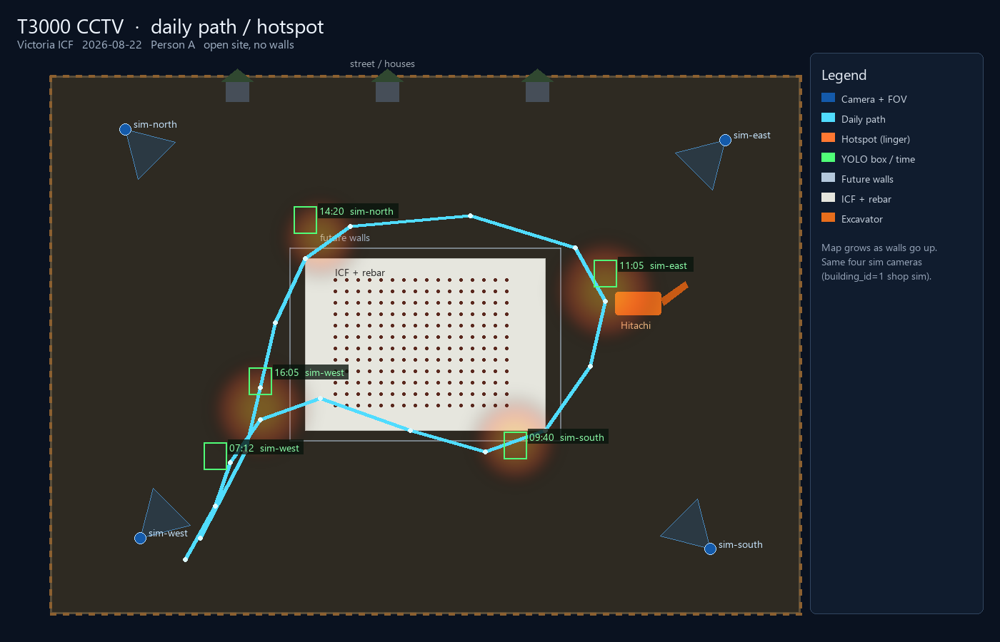

# Daily path / hotspot map

YOLO boxes and a daily path for one person across the four inward job-site cameras (`sim-north`, `sim-east`, `sim-south`, `sim-west`). Open lot, no walls yet. The map grows when walls go up.

## Where it lives

- UI: `T3000/ResourceFile/nvr/hotspot.html` (Tools → CCTV → **Hotspot map**)
- Demo path: `T3000/ResourceFile/nvr/hotspot-demo.json` (same file next to sim clips)
- Render: `tools/render-cctv-hotspot.py`
- Image: `Documentation/cctv/t3000-cctv/images/10-hotspot-map.png`

Cameras on this map are the shop sim set (`CCTV_Camera.building_id = 1`). CRM still fetches by `Building.ID`.

## What you see

Four corner cameras looking in. Cyan trail is the day’s path. Warm blobs are linger hotspots. Green boxes are YOLO sightings with time and camera. Dashed rectangle is future walls.

Demo person is **Person A** on 2026-08-22. Replace `hotspot-demo.json` with live tracks later.
