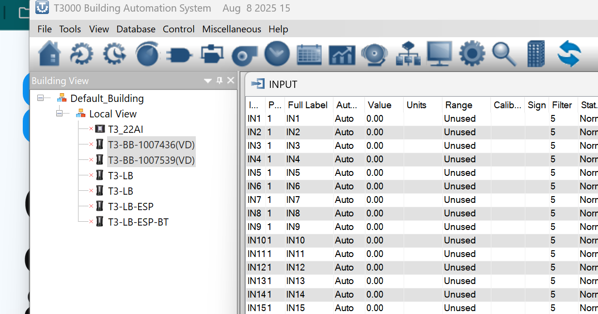

# T3000 CCTV user manual

For homeowners and building operators who already run **T3000** on a Windows PC.

T3000 CCTV is the camera tool inside T3000. You open it from **Tools → CCTV**. You watch live video, play recordings from the same window, and keep motion clips on a disk on this PC. You do not install a separate NVR program, and you do not open extra viewers.

The shop or office can also open the same CCTV from Temco CRM. Building operators use **Tools → CCTV** in T3000.

---

## 1. What CCTV is

T3000 CCTV is the camera page in the same T3000 you already use for controllers, graphics, and alarms.

**What you get**

- One menu item: **Tools → CCTV**
- Live video in a 2×2 tile wall, with a timeline in that same window
- Motion-only recording to a local disk on this PC
- Heatmap, People, Events, and Settings in the same CCTV window
- Cameras stored per T3000 building, so the site you have open is the site you see

**How it runs**

T3000 starts a small recorder on this PC if it is not already running. Live video, playback, and the CCTV pages all stay on this computer. Closing **Tools → CCTV** returns you to the rest of T3000.

Use only T3000 CCTV to hold camera streams. Close CCTV when you are done. Do not open extra viewers for the same cameras.

---

## 2. Open Tools → CCTV

*Real T3000 (Aug 8 2025 build on this PC). Menu bar: File, Tools, View, Database, Control, Miscellaneous, Help.*

*Real T3000 menu bar. CCTV is not on this install yet. It is already in the Maurice source Tools list (between Modbus Register v2 and RegisterList Database Folder) and will appear there in the next T3000 build.*

1. Start **T3000** as usual (it asks for Administrator, same as always).
2. Select the building you want to watch. CCTV uses the building you have open in T3000.
3. On the menu bar choose **Tools → CCTV**.
4. The CCTV window opens on **Live**.

T3000 needs the **Microsoft Edge WebView2 Runtime** — the same runtime HVAC graphics already use. If T3000 offers a download, install it, then choose **Tools → CCTV** again.

T3000 starts the recorder if it is down. If the recorder is not running, the window shows **recorder not running**. Close CCTV, wait a few seconds, and open **Tools → CCTV** again.

Closing the CCTV window returns you to the rest of T3000. Other tools are unchanged.

**One stream rule.** Only T3000 CCTV may hold the camera streams. When you finish, close CCTV. Do not leave it open in the background while another program tries to watch the same cameras.

---

## 3. Live view and timeline

*Live view, 2×2 tiles and timeline. (T3000 window — capture pending)*

Live is the first page you see. Four tiles sit in a 2×2 grid. The timeline sits in that same window — not in a second app.

**Tiles**

Each tile is one camera on the current building. A tile plays that camera’s recording when you are on the timeline, or stays live when you are at “now.”

If a tile is blank or frozen, use **Reconnect**. That drops leftover sessions on this PC and starts the streams again. Do not open another viewer to “check” the camera.

**Timeline in the Live window**

The bar under the tiles is the timeline for this building:

- **Play / Pause** — start or stop the playhead
- **Previous event / Next event** — jump to the last or next motion clip
- **Zoom** — stretch or compress the time scale
- **Hourly ticks** — hours marked on the bar so you can find a time of day

Play skips idle gaps. If nothing moved between 2:00 and 2:40, play jumps to the next motion instead of sitting on empty time.

---

## 4. Playback from the timeline

*Playback on the Live timeline. (T3000 window — capture pending)*

There is no separate Playback app. You review recordings from the timeline on Live.

1. Stay on **Live**.
2. Click a time on the timeline, or use **Previous event** / **Next event**.
3. Press **Play**. Each tile plays that camera’s clip at that time. A camera with no clip at that moment stays live.
4. Press **Pause**, or drag the playhead back to now, to return to live video.

Idle time is skipped automatically. You are moving through motion, not through hours of empty hallway.

To look at one clip with its event details, use **Events** (chapter 7). The timeline is for watching several cameras together.

---

## 5. Heatmap

*Heatmap with floor dots and FOV cones. (T3000 window — capture pending)*

Heatmap shows where people have been on the floor for this building.

**What you see**

- A **dot** for each camera on the floor plan
- A **cone** for that camera’s field of view (FOV)

**How to place cameras on the plan**

- **Drag** a dot to move the camera on the floor.
- Drag the **cone handle** to rotate the field of view.

The layout is saved for this building. Change building in T3000 and you get that building’s plan and cameras.

**Time range**

- **Today** — motion from today
- **Week** — the last seven days
- **All** — everything still on disk
- **Reset** — clear the heatmap overlay (it does not delete recordings)

---

## 6. People

*People list with names, Unknown, and Ignore. (T3000 window — capture pending)*

People is the face list for this building. New faces are enrolled automatically as **Person1**, **Person2**, and so on.

**Name a person**

Type a name in the field and save. The next time that face is seen, Events and the tiles can show the name you typed.

**Unknown**

Click **?** to mark the face as **Unknown**. Use this when you do not know who it is and do not want a made-up Person number in the list.

**Ignore**

Click **×** to **Ignore** that face. Ignored faces are not treated as people you care about. Use this for staff you do not need to track, or for a false detection.

Do not delete recordings from this page. Ignore only changes how that face is handled.

---

## 7. Events

*Events list and clip player. (T3000 window — capture pending)*

Events is the list of motion clips. Each row is one recording.

**List and player**

Select a row. The clip plays in the player on this page. The time, camera, and any person name sit with the row.

**Filter**

Use the camera filter to show one camera, or all cameras on this building.

Events is the place to open a single clip. Live + timeline is the place to scrub several cameras at once.

---

## 8. Settings and recording

*Settings and recording. (T3000 window — capture pending)*

Open **Settings** from the CCTV window. This is where you point recordings at a disk and choose how long to keep them.

**Storage**

Clips stay on a **local disk on this PC**. Pick a path with room to grow, for example `C:\Xdrive\T3000_DVR` on a desktop drive. Do not record to a NAS.

**Motion only**

Recording is **motion only**. If the scene is idle, new clips are not written. There is no 24/7 continuous writer in this product.

**Pre-roll and post-roll**

- **Pre-roll** is **1 second**, taken from the recorder’s ring on this PC. It is not a setting you change on the camera.
- **Post-roll** is how long to keep recording after motion stops. Set it here.

**Retention**

Set how many days of clips to keep. Older motion files are removed when they pass that age.

**Per-camera enable**

Turn recording on or off for each camera. A camera can still appear on Live when recording is off; it simply does not write clips.

After you save, new motion uses the new path and times. Clips already on disk stay where they were until retention deletes them.

---

## 9. Add / discover cameras

Cameras belong to the **T3000 building** you have open. Each camera is stored against that building. Open a different building in T3000 and CCTV shows that building’s cameras only.

The PC and the camera must be on the **same LAN**.

### Discover on the LAN (SADP)

Use **Discover** in the CCTV window. T3000 finds Hikvision cameras with **SADP multicast** on your network.

This is not the Hikvision SADP desktop app. You do not install extra vendor tools. If the list is empty, the camera is off, on another VLAN, or blocked from multicast — add it with RTSP instead.

### Add with RTSP

For a Hikvision camera, use RTSP on **port 554** and path **`/Streaming/Channels/101`**.

1. Give the camera a short name you will recognize, for example `lobby`.
2. Enter the camera address and that RTSP path.
3. Save. The camera attaches to the current T3000 building.

Live tiles use the **sub stream** for viewing so the PC stays light. Do not point the wall of tiles at a heavy main stream.

**ONVIF stays off** unless Temco asks you to turn it on. Discovery is SADP. Everyday add and play is RTSP.

If a tile has no video after you add the camera, check the address, path, and that the camera is on this LAN. Then use **Reconnect** on Live. Do not open another program to test the stream.

---

## 10. Troubleshooting

| You see | What to do |
| --- | --- |
| Prompt to install WebView2 | Install the [Edge WebView2 Runtime](https://developer.microsoft.com/en-us/microsoft-edge/webview2/) (same as HVAC graphics), then **Tools → CCTV** again |
| **Recorder not running** | T3000 starts the recorder when it is down. Close CCTV, wait a few seconds, open **Tools → CCTV** again. If the line is still there, restart T3000 |
| Blank tiles, or a tile that was live and then froze | Click **Reconnect** on Live. Close CCTV when you are finished so nothing else holds the streams |
| No cameras, or the wrong cameras | Confirm the **building** selected in T3000. Cameras are stored per building |
| Discover finds nothing | Same LAN? Camera powered? Multicast allowed? Add the camera with RTSP on port 554, path `/Streaming/Channels/101` |
| Tile added, no video | Check the RTSP path and that viewing is on the **sub stream**. Use **Reconnect**. Do not open extra viewers |
| Disk filling up | Open **Settings**. Confirm motion-only, retention, and a local path (not a NAS) |
| CCTV window closes | Expected. You are back in the rest of T3000. Open **Tools → CCTV** when you want cameras again |

**Still stuck**

1. Close CCTV.
2. Confirm T3000 is on the building that owns the cameras.
3. Open **Tools → CCTV** and wait for Live.
4. If you see **recorder not running**, restart T3000 and try once more.
5. Call Temco with the building name, the camera name, and what the window showed.

Do not open extra viewers on this PC. Only T3000 CCTV should hold the streams.
