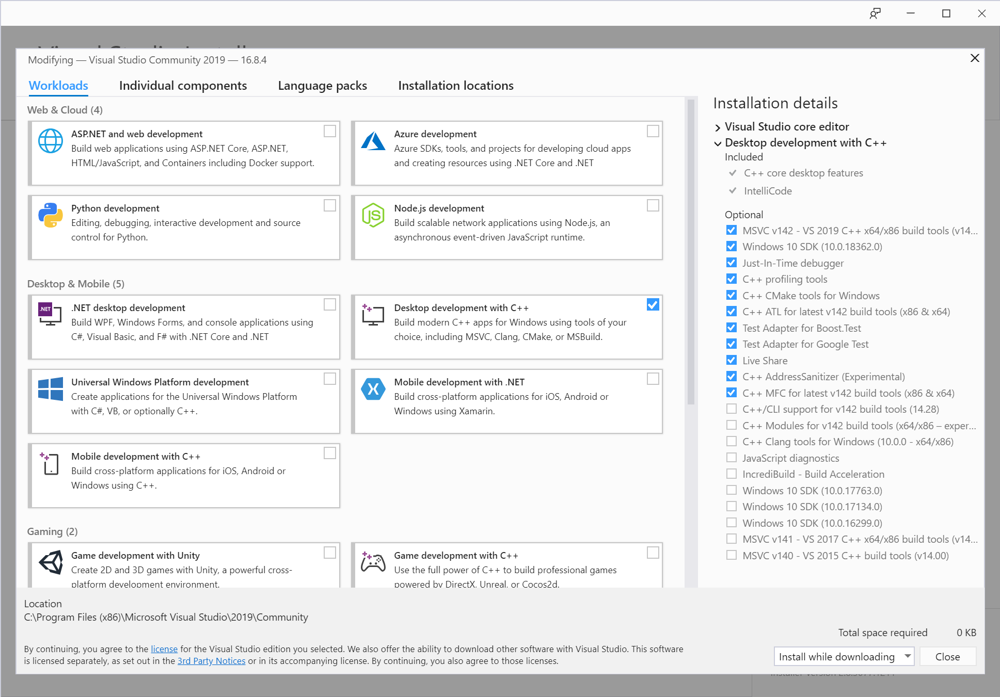

Using CMake to compile T3000
============================

We have setup CI using CMake and github actions. This document explains compilation running locally on your machine.

Prerequisites
-------------
T3000 uses MFC, so make sure you have MFC installed within Visual Studio. If you are working with version above Visual Studio 2017, CMake comes bundled with it. If not, please install [CMake](https://cmake.org/)

Specific instructions for Visual Studio 2019 on Windows 10 are:
* Download the Community edition of [Visual Studio 2019](https://visualstudio.microsoft.com/downloads/) installer.
* Run the installer and select:
	* Desktop development with C++
	* C++ MFC for latest 142 build tools (x86 & x64)

Getting a build (What to do if CI fails with a build error)
-----------------------------------------------------------
* Checkout T3000
* Open Visual Studio command prompt
* Create a folder named build and switch to it
* Issue the commands:
   * cmake -A Win32 .. -DCMAKE_TOOLCHAIN_FILE="..\vcpkg-export-openssl\scripts\buildsystems\vcpkg.cmake" 
   * cmake --build .
* If the above fails this is mostly due to:
   * Compilation errors in one or more CPP files
   * Developer _forgot_ to add new files to CMakeLists.txt

