1. Run Visual Studio in administator mode(Right click -> Run as administator)
2. Build SliderControlLibrary(ir is registered dll with regasm)
3. Open MFC Conrol Designer 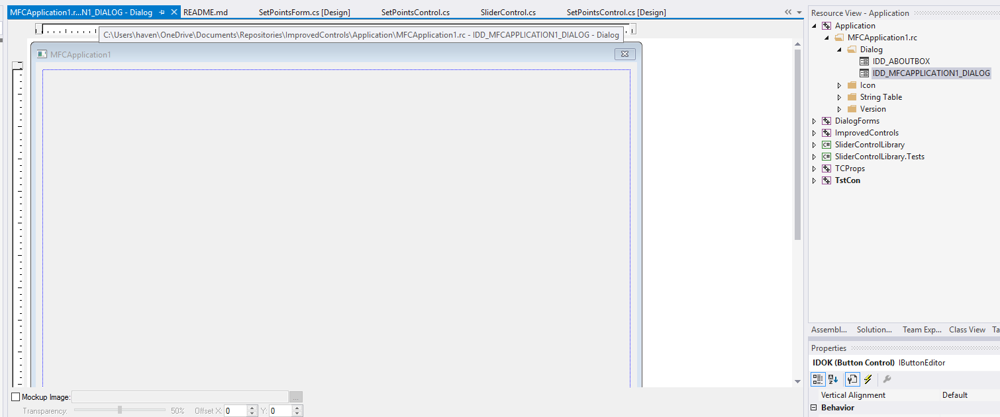
4. Right click on dialog and select Insert ActiveX Control 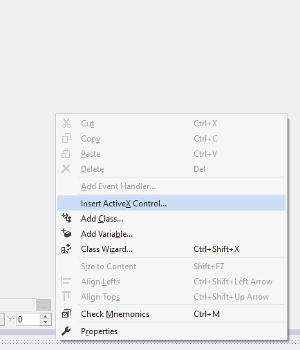
5. Select need control 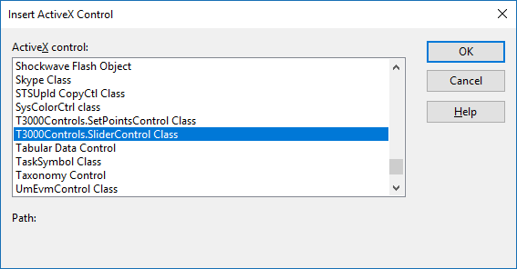
6. Control added 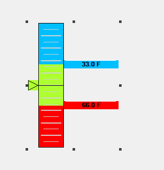. Properties and events are available: 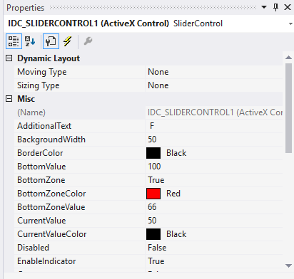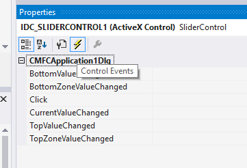
7. For set property from code need right click and select Add Variable 
8. Input variable name and click Finish 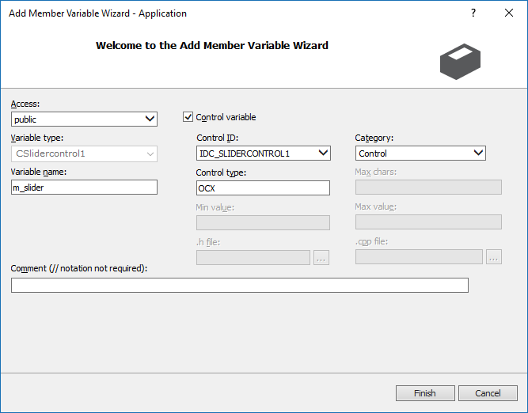
9. If class not created, need next actions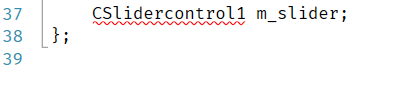:
10. Right click to project, Add -> Class.. 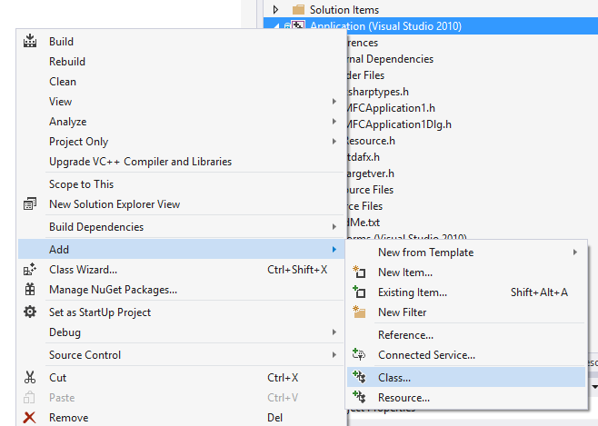
11. Select MFC -> MFC Class From TypeLib 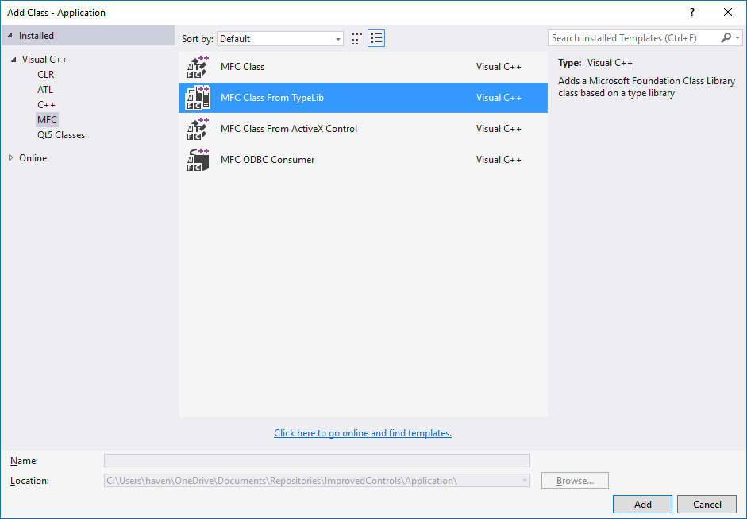
12. Select SliderControlLibrary from dropdown menu, select need interface and click to button ">". Click finish 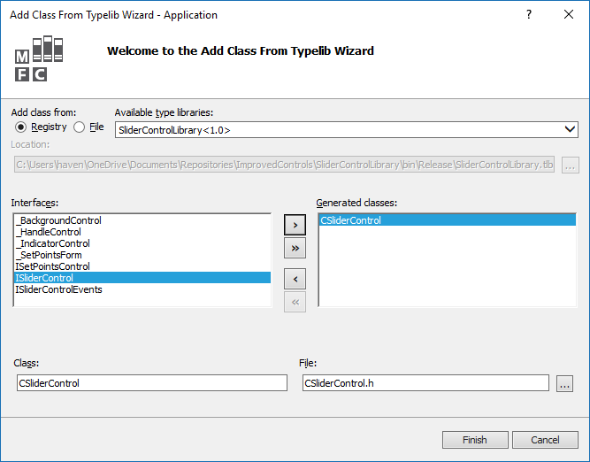
13. Include header , rename class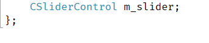, replace this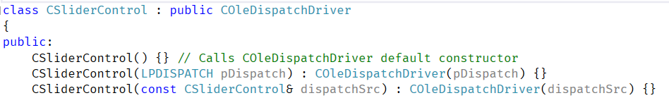 as this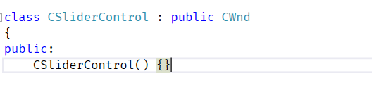. Add include in stdafx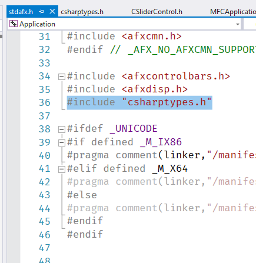. Create file csharptypes.h with next data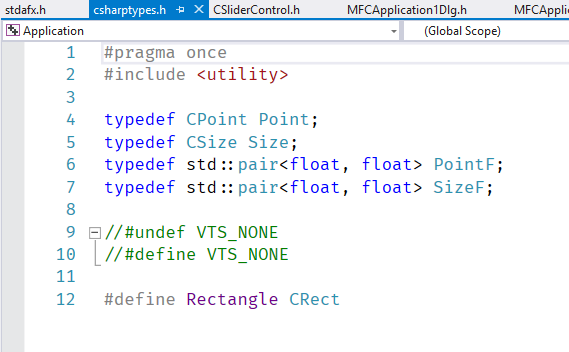
```vc
#pragma once
#include <utility>

typedef CPoint Point;
typedef CSize Size;
typedef std::pair<float, float> PointF;
typedef std::pair<float, float> SizeF;

//#undef VTS_NONE
//#define VTS_NONE 

#define Rectangle CRect
```
14. Enter need properties 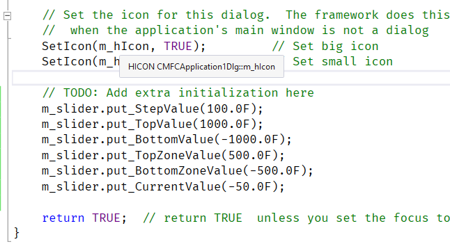 and get results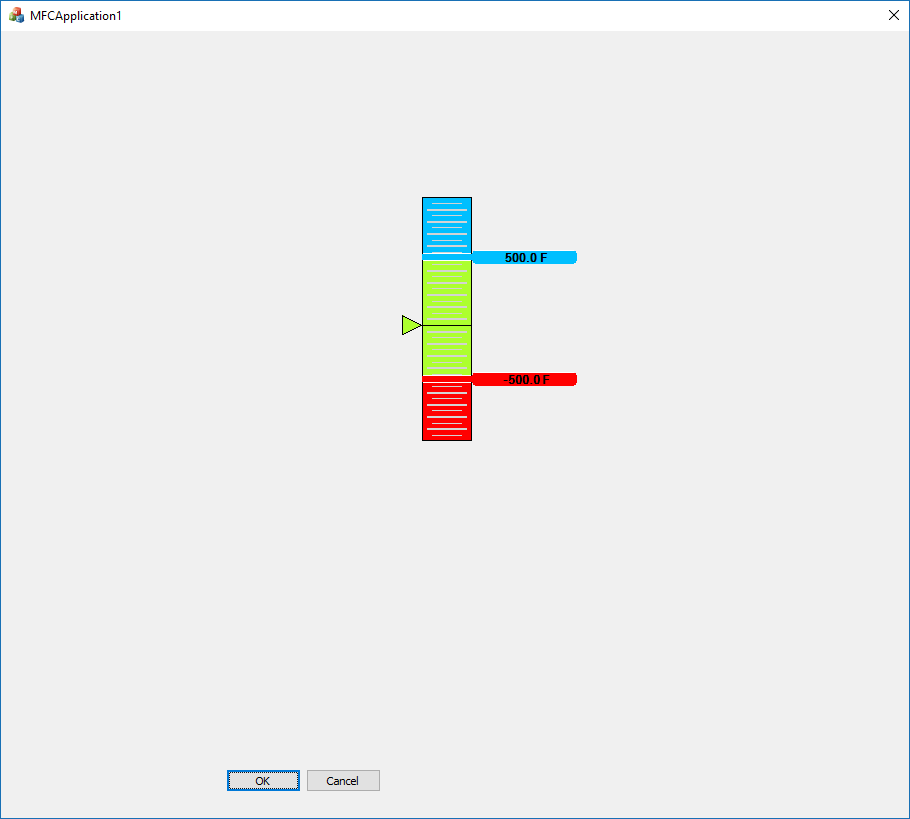.
15. Thanks!

#Alternative:
1. Run Visual Studio Native Tools Command Promt in administator mode 
2. Go to SliderControlLibrary dll path
3. regasm SliderControlLibrary.dll /codebase /tlb SliderControlLibrary.tlb
4. Go to 3-15 first method.

#For internal usage in the resource file:

SliderControl guid: "ABA068FC-6B49-3031-B74A-1C51A3C8833A"

SetPointsControl guid: "A7CFC298-FE4E-4819-B868-2C014BA244DE"

#Other

Please, add post build events(for release and debug): 
```
copy /Y "..\SQLiteDriver\sqlite3.dll" "..\T3000 Output\release\"
copy /Y "..\SQLiteDriver\sqlite3.dll" "..\T3000 Output\debug\"
```
You can also add dependencies (Solution -> Properties -> Project Dependencies) to exclude situations where, after the build, the old version of the lib file of the dependent projects is used

Still, it is desirable to add a standard .gitignore .gitattribute files and Visual Studio.
https://github.com/HavenDV/ImprovedControls/blob/master/.gitattributes
https://github.com/HavenDV/ImprovedControls/blob/master/.gitignore

Before closing, need delete control with next code:
```
m_slider.Dispose();
```

In control .h file use next #import directive
```
#import "progid:T3000Controls.SliderControl" no_namespace
```